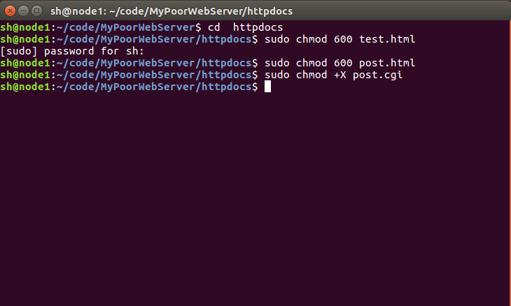
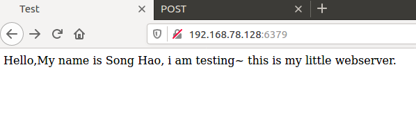
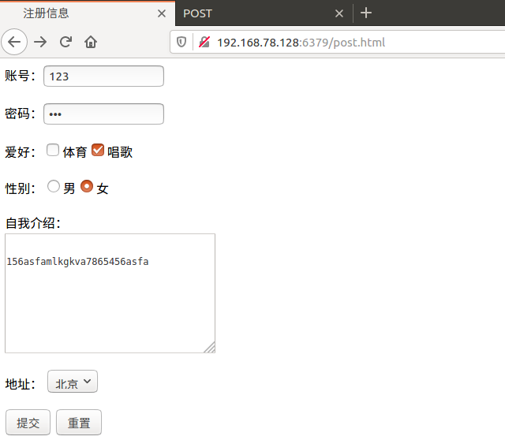
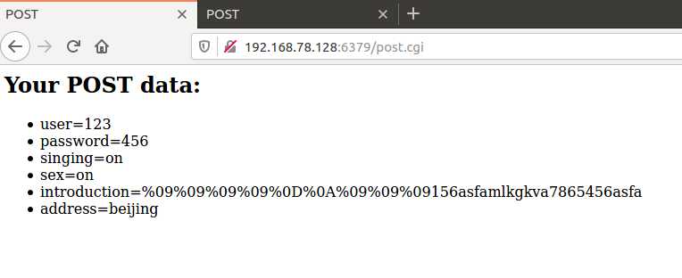
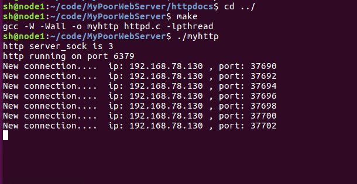

<h3 align="center">一款可运行的基于C++11 实现的HTTP服务器</h3>

### 1、简介

#### 0、插入一条更新

给大家一个思路，我把基于C++版本的项目删除，只留下以前写的基于C的项目，如果能够在C的基础上将之改写为C++版本，就变成你的项目了。

按照 【2、编译】中的步骤还是可以顺利运行的，可以自行尝试~

#### 1、由来

该项目是基于C++ 实现的HTTP服务器，也就是那种烂大街的WebServe服务器，不过由于是自己动手做的，所以还是很有意义的就上传上来了。

该项目也是阿秀自己在2020年找工作时简历上的第二个项目。

关于项目的详细功能介绍请看该文章的项目描述处：[一份百投百中的计算机校招简历是如何迭代足足26版的？](https://mp.weixin.qq.com/s?__biz=Mzg2MDU0ODM3MA==&mid=2247484253&idx=1&sn=df7ade24514881e60a40cde578d2b3da&chksm=ce25ff20f95276364a71e649141ca4c53c97f1fc1cc913a20c67586cdf620317f978e928e2b7&scene=126&sessionid=1608343657&key=83b7fdc2e28db9650cdc10bacd0a0f097ad16beb02d6dbc1e0e4005a484887cafb0e46484f047c1977e805b3430b2ad1975ace69a7c15bf87e649d62ca22923d629791ccb42607a6796faaed8c3361146e45b35b3b1fe45833cecff96a6ccabd23a5e2787b976cc47ba6ba838af73496f0887ccdab42410c9100edc577fd1443&ascene=1&uin=MTU0MTg3NjkyOA%3D%3D&devicetype=Windows+10+x64&version=62090538&lang=zh_CN&exportkey=AR%2FnqNBKRjClxG%2FcoguEL7Y%3D&pass_ticket=%2FfKkpK2i7c7MrCBoE0fGp%2FiMhDilgMJjoVfqMtz%2Bc7zLa%2BEIbDVllJxkTqtHUO03&wx_header=0)

（如果有需要简历模板的同学可以看一下上面这篇文章的文末处，有我个人的简历模板下载方式）

#### 2、其余

如果还有对该项目有疑问的同学可以加我个人微信：**coderxiu2**，我会在工作之余进行免费答疑。

最好在看过文末的两本书即《TCPIP网络编程》和《Linux高性能服务器编程》或者对于C++网络编程有一定了解后，再来进行实践本项目。

### 2、编译

请严格按照下面步骤进行编译

#### 1、编译准备工作

文件夹中的 post.html 以及 post.cgi 文件需要一定的权限才可以执行。

所以需要先进行权限给予。

第一步、克隆项目并给予足够权限，打开命令行依次输入下述命令：

~~~c
git clone  https://github.com/forthespada/MyPoorWebServer

cd  httpdocs

sudo chmod 600 test.html

sudo chmod 600 post.html

sudo chmod +X post.cgi
~~~

在进行sudo命令时，需要输入Linux下的sudo命令。

如下图所示：

如果忘记自己设置的sudo密码，可以按照如下教程进行密码重置：[sudo密码重置](https://blog.csdn.net/TravisPan/article/details/88682529?utm_medium=distribute.pc_aggpage_search_result.none-task-blog-2~aggregatepage~first_rank_v2~rank_aggregation-1-88682529.pc_agg_rank_aggregation&utm_term=linux%E5%BF%98%E8%AE%B0sudo%E5%AF%86%E7%A0%81&spm=1000.2123.3001.4430)

#### 2、编译执行

依次输入下述命令即可。

~~~c
cd  ../

make

./myhttp
~~~

#### 3、整体过程图

1、项目默认端口号是6379，如像下图地址栏所示，默认显示的界面是是test.html界面。

2、运行成功后默认显示的为test.html界面，同时同一路径下还有 post.html界面，可以将地址栏的“**test.html**”改成“**post.html**”来进行查看。

#### 4、整体框架图

#### 6、参考资料

《TCPIP网络编程》-韩国-尹圣雨

《Linux高性能服务器编程》-中国-游双

https://www.cnblogs.com/qiyeboy/p/6296387.html

https://www.jianshu.com/p/18cfd6019296
